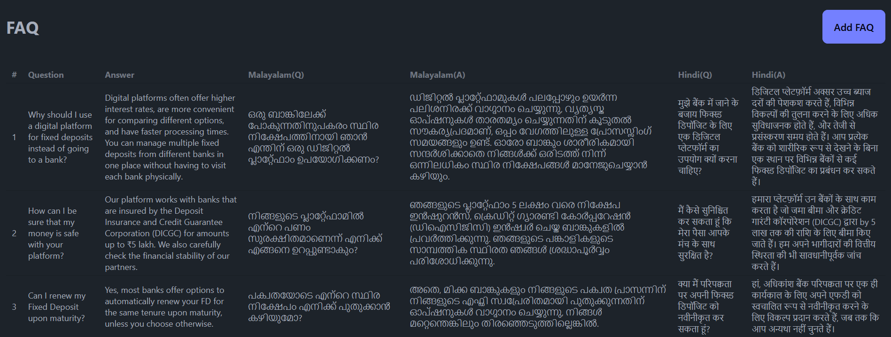
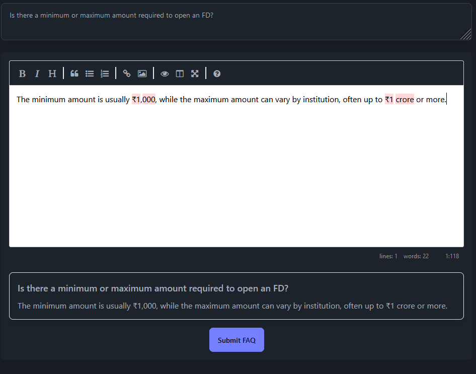

# 📌 **FAQ Management System** – *BHARATHFD*

## imagese




## 🚀 **Live Deployment**  
🔹 **Frontend:** [Visit Here](https://answer-flow-pi.vercel.app/)  
🔹 **Backend:** [Visit Here](https://answerflow-0j2v.onrender.com/)  

## 🛠 **Deployment Details**  
- **Backend:** Docker + Render.com  
- **Frontend:** Vercel  

## 💻 **Tech Stack**  
### **Backend**  
- Node.js  
- TypeScript  
- Express.js  
- Redis  
- MongoDB  
- JWT Authentication  
- Docker & Docker Compose  
- Pritter  
- Google translate API  
- Mocha/Chai  

### **Frontend**  
- Next.js  
- React.js  
- Tailwind CSS  
- Simple Markdown Editor  

## 📑 **API Documentation**  

### **Authentication**  
🔹 **Login** – `POST /api/v1/auth/login`  

### **FAQ Management**  
🔹 **Get All FAQs** – `GET /api/v1/faq`  
🔹 **Get FAQs in English** – `GET /api/v1/faq?lang=en`  
🔹 **Get FAQs in Hindi** – `GET /api/v1/faq?lang=hi`  
🔹 **Get FAQs in Malayalam** – `GET /api/v1/faq?lang=mal`  
🔹 **Add a New FAQ** – `POST /api/v1/faq`  
   - **Request Body:**  
     ```json
     {
       "question": "Your FAQ question here",
       "answer": "Corresponding answer here"
     }
     ```

---

## 🛠 **Installation Guide**

### **Backend Setup**  

1. **Clone the Repository**  
   ```bash
   git clone https://github.com/BHARATHFD/FAQ-Management-System.git

2. **Backend**
    ```bash
   cd backend
   npm install
   npm run dev
3. **Fronted**
  ```bash
   cd frontend
   npm install
   npm run dev

   make this markdown good reduce size of images
